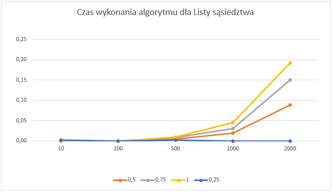

# Dijkstra’s shortest path algorithm
## General info
It my implementation of Dijkstra's alghorithm. Alghorithm can be used to find the shortest connection between two vertices.  
## Input data structure
Graph for Alghorithm can be described as a weighted incidence list(Weighted_graph class) or as a incidence matrix(WeightedGraphMatrix class). Both of this class inherit from abstract class Graph.
Data can be generated randomly with constructor that specifies the density and size of graph. Data also can be loaded from file with 
form given below:  
- first line(define of graph structure):  
Number of branches|Number of verticies|Starting vertice(one tip of path)
- normal line(define branches):  
starting vertice|end vertice|weight of connection  
  
  \* "|" is space
## How to use
- make instance of Alghorithm using constructor below:  
`public DjikstraAlgoritm(Graph downloadedGraph)`  
downloadedGraph is a graph that inherits from Graph abstract class
- call  `public Branch FindTheShortestWayTo(int trg)`  
it finds shortest way from Starting vertice to trg(targt) but also process all paths from vertices to starting vertice
it returns weight of shortest way and las vertice before target(it is possible to decode whole path by this).
- save solution to file by `public void saveToFile(string filePath)`

 
## Time complexity
Time complexity as a function of the number of vertices and density

    
  
